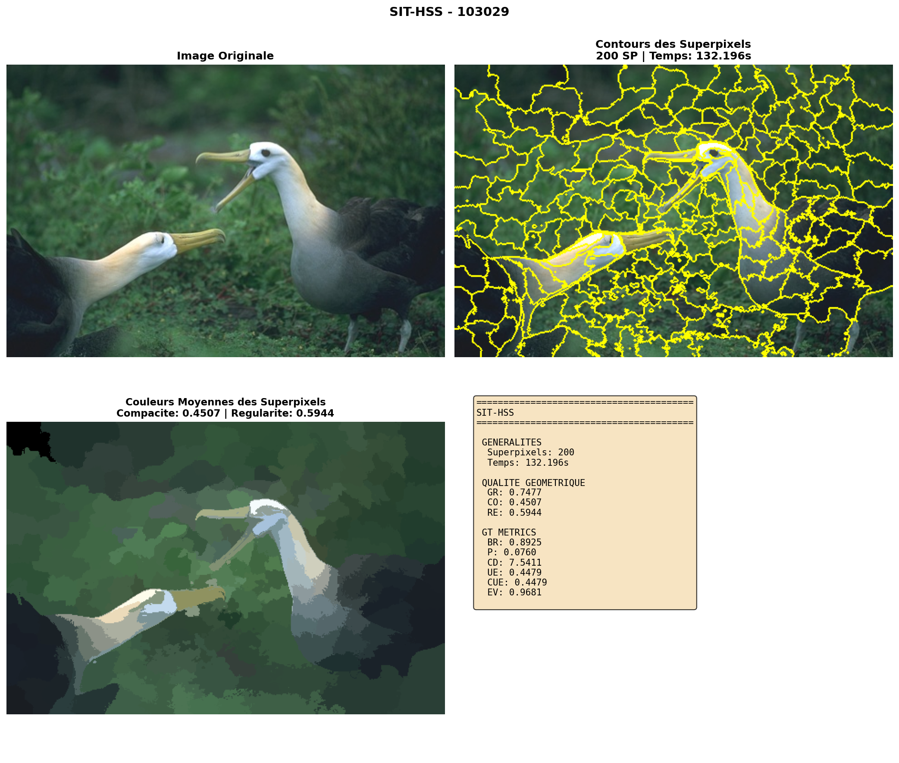

# Segmentation Hiérarchique de Superpixels via Théorie de l'Information Structurelle (SIT-HSS)

**Projet M2 VMI - Modélisation de systèmes intelligents**  
**Etudiant: Yanis (SIT-HSS)**  

---

## Introduction

Ce projet se fait dans le cadre du cours **Modélisation de systèmes intelligents** du Master 2 Vision et Machine Intelligentes du l'Université Paris Cité. Il consiste à étudié et comparé deux méthodes de segmentation par superpixels. 

Ce dépot correspond au code reprenant la méthode de l'article, *Hierarchical Superpixel Segmentation via Structural Information Theory* [1] (SIT-HSS). L'ensemble des méthodes se trouve sur le dépôt suivant : https://github.com/Evowind/slic-hierarchical-superpixels.

### Segmentation en superpixels

Il s'agit d'un processus qui regroupe des pixels adjacents ayant des caractéristiques similaires comme la couleur et la position pour former des régions cohérentes appelées superpixels. Cette technique simplifie considérablement la représentation d'une image en réduisant le nombre de primitives à traiter, ce qui facilite ensuite des tâches de vision par ordinateur plus complexes comme la détection d'objets ou la classification d'images.

---

## Théorie de l'Information Structurelle

SIT-HSS repose sur la **théorie de l'information structurelle** qui quantifie la complexité et les patterns de connectivité d'un graphe via des arbres d'encodage.

### Concepts clés

**Entropie Structurelle** : Nombre moyen minimum de communautés nécessaires pour encoder les nœuds accessibles lors d'une marche aléatoire sur le graphe.

**Entropie 1D** (H⁽¹⁾) : Mesure l'information contenue dans le graphe
- Utilisée pour la construction du graphe
- Maximiser H⁽¹⁾ → retenir plus d'information

**Entropie 2D** (H⁽²⁾) : Mesure la qualité du partitionnement
- Utilisée pour le partitionnement hiérarchique
- Minimiser H⁽²⁾ → partitions optimales

---

## Méthode SIT-HSS

### 1. Construction du Graphe (Maximisation H⁽¹⁾)

**Principe** : Contrairement aux méthodes classiques qui connectent uniquement les pixels adjacents directs, SIT-HSS explore progressivement le voisinage pour capturer les relations non-adjacentes.

**Algorithme** :

1. **Initialisation** : Graphe sans arêtes, pixels = nœuds
2. **Expansion progressive** : 
   - Rayon r = 1 : 8 voisins directs
   - Rayon r = 2, 3, ... : voisinage étendu
3. **Critère d'arrêt** : ΔH⁽¹⁾ < τ (plateau d'entropie)
4. **Sélection** : Rayon optimal qui maximise l'information retenue

**Distance entre pixels** :
```
ρᵢⱼ = ||cᵢ - cⱼ||² · ||sᵢ - sⱼ||
```
où :
- `cᵢ, cⱼ` : caractéristiques couleur (espace Lab)
- `sᵢ, sⱼ` : coordonnées spatiales

**Poids normalisés** :
```
Wᵢⱼ = exp(-ρᵢⱼ / (t · moyenne(ρ)))
```

### 2. Partitionnement Hiérarchique (Minimisation H⁽²⁾)

**Principe** : Fusion itérative des partitions pour minimiser l'entropie structurelle 2D.

**Algorithme** :

1. **Initialisation** : Chaque pixel = partition indépendante
2. **Itération** :
   - Pour chaque superpixel pᵢ
   - Trouver voisin adjacent pⱼ maximisant ΔH⁽²⁾
   - Fusionner pᵢ et pⱼ
3. **Arrêt** : Nombre de partitions = K (taille cible)

**Réduction d'entropie** :
```
ΔH⁽²⁾ₚᵢ,ₚⱼ = H⁽²⁾_avant - H⁽²⁾_après
```

**Contrainte de connectivité** : Fusion uniquement entre superpixels spatialement adjacents.

---

## Avantages de SIT-HSS par rapport aux méthodes classiques

| Aspect | Méthodes classiques | SIT-HSS |
|--------|-------------------|---------|
| **Information captée** | Relations adjacentes uniquement | Relations non-adjacentes + globales |
| **Construction graphe** | Statique, rayon fixe | Adaptive, maximisation H⁽¹⁾ |
| **Partitionnement** | Heuristiques simples | Optimisation théorique (H⁽²⁾) |

---

## Métriques d'évaluation

| Métrique | Définition |
|--------|------------|
| **GR (Global Regularity)** | Mesure l’uniformité de la taille et de la forme des superpixels sur l’ensemble de l’image. Une valeur élevée indique des superpixels réguliers. |
| **CO (Compactness)** | Évalue à quel point les superpixels sont compacts, c’est-à-dire proches de formes géométriques simples comme des cercles ou des carrés. |
| **RE (Regularity)** | Combine plusieurs aspects de régularité afin de mesurer l’homogénéité globale des superpixels. |
| **BR (Boundary Recall)** | Mesure le pourcentage de contours réels de l’image correctement capturés par les frontières des superpixels. Une valeur élevée indique une meilleure adhérence aux contours. |
| **P (Precision)** | Mesure la proportion des frontières de superpixels qui correspondent réellement à des contours présents dans l’image. |
| **CD (Contour Density)** | Quantifie la longueur moyenne des contours des superpixels. Une valeur faible indique une moindre sur-segmentation. |
| **UE (Undersegmentation Error)** | Mesure le débordement des superpixels sur plusieurs régions de vérité terrain. Une valeur faible indique un bon respect des frontières des objets. |
| **CUE (Corrected Undersegmentation Error)** | Version améliorée de l’erreur de sous-segmentation (UE) qui corrige certains biais de calcul. |
| **ASA (Achievable Segmentation Accuracy)** | Représente la fraction maximale de pixels correctement classés en attribuant à chaque superpixel la meilleure étiquette possible. |
| **EV (Explained Variation)** | Mesure la cohérence des couleurs à l’intérieur de chaque superpixel. Une valeur élevée indique une forte similarité des pixels d’un même superpixel. |

---

## Résultat

On utilise le dataset BSDS500 [5], ici on prend une image pour illustrer le type de résultats que l'on peut obtenir.

### Visualisation




**Observations** :

* SIT-HSS capture efficacement les frontières des objets grâce à la prise en compte des relations non-adjacentes
* Excellente adhérence aux contours
* Gestion des petits objets et détails fins
* Superpixels cohérents avec les structures sémantiques de l'image

---

### Performances

On a effectué une segmentation en 200 superpixels sur une image et dans cette partie on évalue l'efficacité de la segmentation sur cette image.

#### Métriques utilisant la ground truth

| Métrique          | Scores        |
| ----------------- | ------------- |
| Compacité         | 0.7477        |
| Régularité        | 0.4507        |
| Global Regularity | 0.5944        |

#### Métriques n'utilisant pas ground truth

| Métrique                       | Scores        |
| ------------------------------ | ------------- |
| Boundary Recall (BR)           | 0.8925        |
| Under-segmentation Error (UE)  | 0.4479        |
| Corrected UE                   | 0.4479        |
| Achievable Seg. Accuracy (ASA) | 0.9720        |
| Precision (P)                  | 0.0760        |
| Contour Density (CD)           | 7.5411        |
| Explained Variation            | 0.9681        |

### Temps d'exécution

SIT-HSS : 132.196s

### Remarque

Le nombre de superpixels voulus est important notamment par rapport au nombre de rayons testés lors de la construction du graphe. En effet moins on a de superpixels plus ils sont grands et inversement, ainsi lorsque l'on en a moins on a besoin de plus d'informations donc d'un rayon plus grand. Cependant plus le rayon est important plus le temps d'exécution sera long, il faut donc faire un compromis sur le entre essayer de trouver le nombre de rayons optimal et une borne maximum à ne pas dépasser pour ne pas impacter trop lourdement le temps d'exécution. Avec ceci il se peut que dans certains cas où le rayon optimal est grand pour une image donnée on est pas les meilleurs résultats possibles. 

---
## Sondage sur les méthodes de segmentations

### Méthodologie et profil du panel
L'évaluation a été menée auprès de **12 participants** analysant un jeu de **5 images** tests. Le protocole visait à comparer trois algorithmes : **SLIC**, **SLIC_IPOL** et **SIT-HSS**.

* **Expertise technique :** 75 % des évaluateurs sont spécialisés en Vision par Ordinateur.
* **Expérience :** Un tiers des testeurs (33 %) possède une expérience préalable avec les superpixels.
* **Clarté du protocole :** La méthodologie a été jugée efficace avec une note moyenne de satisfaction de **4.17/5**.

---

### Analyse comparative des résultats
Le tableau suivant résume les scores moyens (échelle 1 à 5) attribués par les évaluateurs pour chaque critère clé.

| Critère | SLIC | SLIC_IPOL | SIT-HSS | Tendance |
| :--- | :---: | :---: | :---: | :--- |
| **Qualité des contours** | 3.27 | 3.37 | **3.55** | Supériorité de **SIT-HSS** |
| **Cohérence chromatique** | 3.28 | 3.28 | **3.47** | Supériorité de **SIT-HSS** |
| **Régularité / Uniformité**| **3.32** | 3.33 | 3.20 | Supériorité de **SLIC** |
| **Moyenne Générale** | 3.29 | 3.33 | **3.41** | **SIT-HSS** est la mieux notée |

---

### Focus : La Méthode SIT-HSS
Bien que SIT-HSS soit pénalisée par une géométrie moins régulière, elle s'impose comme la solution préférée pour la précision analytique.

#### Points Forts (Atouts techniques)
* **Fidélité structurelle :** SIT-HSS est perçue comme la méthode la plus "fidèle à la réalité".
* **Précision des frontières :** Elle permet de mieux distinguer les contours complexes (branches, motifs fins, visages) là où les autres méthodes tendent à fusionner les plans.
* **Contraste et Détails :** Elle offre des détails et des contrastes plus marqués, essentiels pour l'identification d'objets.

#### Points Faibles (Limites observées)
* **Irrégularité géométrique :** Les superpixels présentent des tailles et des formes hétérogènes, ce qui peut nuire à l'esthétique visuelle.
* **Sur-segmentation :** Dans certains cas, l'algorithme se focalise sur des détails trop infimes au détriment de la structure globale de l'image.

---

### 4. Synthèse des Préférences Globales

#### Le choix du "Meilleur Équilibre"
Lorsqu'il s'agit de désigner la méthode offrant le meilleur compromis par image (60 évaluations cumulées) :
* **SIT-HSS : 56.7 %** .
* **SLIC_IPOL :** 20.0 %.
* **SLIC :** 16.7 %.

#### Classement par rang moyen
Paradoxalement, **SLIC** obtient le meilleur rang moyen (1.58) devant **SIT-HSS** (1.83). Cela suggère que si SIT-HSS est souvent la préférée, SLIC reste la méthode la plus consensuelle et robuste "par défaut".

---

## Arborescence du dépôt

```
slic-ipol-implementation/
├── src/
│   ├── methods/
│   │   └── slic/
│   │       ├── hierarchical_seg.py   # Implémentation SIT-HSS original
│   │       └── utils.py              # Utilitaires 
│   ├── evaluation/
│   │   ├── metrics.py                # Métriques (BR, UE, ASA, etc.)
│   │   └── visualize.py              # Fonctions de visualisation
│   ├── preprocessing/
│   │   └── image_loader.py           # Chargement BSDS500
│   └── utils/
│       ├── color_space.py            # Conversions RGB/Lab
│       └── distance.py               # Distance
├── experiments/
│   └── run_hierarchical.py           # Exécution simple
├── data/
│   └── BSDS500/                      # Dataset
├── images/                           # Sortie démo
├── results/                          # Résultats générés + Etude Humain
├── quick_start_hss.py                # Démo rapide
└── requirements.txt                  # Dépendances
```

---

## Installation et utilisation

### Prérequis

```bash
python >= 3.8
torch >= 1.10.0
CUDA (optionnel, recommandé)
```

### Installation

Pour l'installation suivez l'un des deux blocs de commandes suivant :

* Pour Linux et Mac :

```bash
git clone git@github.com:Kemoory/SIT-HSS-evaluation.git
cd SIT-HSS-evaluation
python -m venv .venv
source .venv/bin/activate  # Linux/Mac
pip install -r requirements.txt
```
* Pour  Windows :
```bash
git clone git@github.com:Kemoory/SIT-HSS-evaluation.git
cd SIT-HSS-evaluation
python -m venv .venv
.venv\Scripts\activate     
pip install -r requirements.txt
```

### Dataset BSDS500

Télécharger depuis : [BSDS500](https://www2.eecs.berkeley.edu/Research/Projects/CS/vision/grouping/resources.html) [5]
puis extraire dans `data`.

### Utilisation

**Démo rapide**

```bash
python quick_start_hss.py
```

**Execution SIT-HSS sur 3 images (test)**

```bash
python experiments/run_hierarchical.py --split test --max_images 3 --g data --save
```

**Execution complète sur split de test**

```bash
python experiments/run_hierarchical.py --split test --g data --save
```

**Avec paramètres personnalisés**

```bash
python experiments/run_hierarchical.py \
    --split test \
    --n_segments 600 \
    --t 0.1 \
    --tau 2e-7 \
    --max_radius 7 \
    --g data \
    --save
```

**Utilisation dans votre code**

```python
from src.methods.hierarchical.hierarchical_seg import SITHSS
from PIL import Image
import numpy as np

# Charger image
image = np.array(Image.open('image.jpg'))

# SIT-HSS
sithss = SITHSS(
    n_segments=600,
    t=0.1,
    tau=2e-7,
    max_radius=7,
    device='cuda'  # ou 'cpu'
)
labels = sithss.fit(image)
```

---

## Conclusion

### Synthèse des résultats
L'étude et l'évaluation de la méthode **SIT-HSS** permettent de dégager plusieurs conclusions majeures :

* **Innovation théorique** : L'application de l'entropie structurelle effective à la superpixelisation propose un nouveau paradigme de segmentation fondé sur une hiérarchie d'encodage optimisée.
* **Performance de l'état de l'art** : Selon les données de l'article de référence, SIT-HSS surpasse les méthodes actuelles sur l'ensemble des critères de segmentation évalués.
* **Validation expérimentale** : L'évaluation humaine confirme cette supériorité technique. SIT-HSS est perçue comme offrant le meilleur équilibre global par la majorité des testeurs (56,7 %), se distinguant particulièrement par sa fidélité aux contours et sa précision chromatique.

---

### Application à l'IA ?
Les méthodes de segmentations par superpixels ne sont pas incompatibles avec l'IA dans notre cas on a :

* **Complémentarité avec les GNN** : Ils constituent une unité d'entrée idéale pour les Graph Neural Networks, permettant de simplifier la topologie de l'image sans perdre d'information structurelle.
* **Interprétabilité** : Contrairement aux modèles "boîte noire", SIT-HSS repose sur des arbres d'encodage explicites qui facilitent la compréhension des décisions de segmentation.
* **Efficacité et sobriété** : Sa capacité à produire des résultats de haute qualité avec des ressources optimisées en fait un candidat privilégié pour l'Edge Computing et l'imagerie satellite.

---

### Challenges futurs
Le potentiel de SIT-HSS ouvre la voie à plusieurs axes de recherche futurs :

1. **Intégration Deep Learning** : Inclusion directe dans les pipelines d'apprentissage, notamment pour des opérations de Graph Pooling basées sur la structure hiérarchique de l'algorithme.
2. **Cohérence temporelle** : Extension aux données vidéo pour assurer une stabilité de segmentation entre les trames via l'entropie structurelle de dimension supérieure.
3. **Optimisation haute résolution** : Développement d'implémentations multi-GPU pour le traitement en temps réel d'images à très haute résolution.
4. **Adaptation sectorielle** : Spécialisation des paramètres pour des domaines exigeants tels que l'analyse médicale ou la surveillance satellitaire.


---

## Références

[1] Xie, M., Peng, H., et al. "Hierarchical Superpixel Segmentation via Structural Information Theory", arXiv:2501.07069, 2025

[5] BSDS500 Dataset: https://www2.eecs.berkeley.edu/Research/Projects/CS/vision/grouping/resources.html

[6] Code source officiel: https://github.com/SELGroup/SIT-HSS

